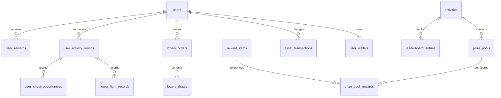

# FlowerLottery 后台系统反向设计（阶段一）

## 1. 分析结论

分析依据为需求文档、现有 Vue3 H5 路由、页面、组件、静态数据与组件事件。

现有 H5 只有 `/` 与 `/ranking` 两个路由，没有 Axios/fetch、认证存储或服务端状态；余额、花朵进度、领奖状态、抽奖记录与榜单均是本地静态数据。后端应提供稳定领域 API，后续接入时保持已有页面结构、样式、路由、动画和组件事件不变。

系统按活动实例建模。抽奖、资产、花朵、宝箱、阶段奖励、榜单和先抽后付均关联活动，不能写死为单次活动。

## 2. 页面与业务映射

| 页面/组件 | 后端能力 | 管理能力 |
|---|---|---|
| 登录入口 | 登录、刷新令牌、当前用户 | 用户状态、重置密码 |
| `Home.vue` | 活动首页聚合 | 活动上下线与首页配置 |
| `TopControls.vue` | 钱包、花瓣兑换 | 资产流水、人工调账 |
| `WishBottom.vue` | 1/10/30 抽、先抽后付 | 奖池、概率、成本 |
| `GameGuide.vue` | 规则与奖励目录 | 文案、资源、奖励配置 |
| `FlowerBox.vue` | 轮次与宝箱机会 | 点亮规则、宝箱配置 |
| `FlowerDrawer.vue` | 开箱、候选与选择 | 候选池、状态排查 |
| `AccFlower.vue` | 阶段奖励与领取 | 阶段奖励配置 |
| 记录弹窗 | 抽奖、点亮记录分页 | 全局记录检索 |
| `Ranking.vue` | Top 20 与本人排名 | 冻结、结算、发奖 |
| 我的奖励 | 奖励分页、选择确认 | 补发与状态查询 |

## 3. 核心业务流程

### 3.1 资产兑换

校验活动、档位和余额；事务内锁定钱包，扣金币、加花瓣、写资产流水和兑换订单。客户端 `request_id` 配合唯一索引实现幂等。

### 3.2 正式抽奖

1. 校验活动、奖池、抽数、花瓣余额和轮次状态。
2. 锁定钱包与当前轮次，预扣最大花瓣成本。
3. 按单抽顺序抽奖励、计算点亮、写明细并发奖。
4. 到 6/12/18 朵增加宝箱机会；到 18 朵立即停止。
5. 退回未执行抽数的花瓣并写退款流水。
6. 榜单只增加实际消耗花瓣。

概率统一使用整数权重，所有规则和奖励保存交易快照。

### 3.3 花朵、宝箱与轮次

需求概率表的“第一/二/三轮”与“每轮 18 朵”冲突。本设计解释为一个业务轮次内三个阶段（1-6、7-12、13-18）。每次单抽先累计等价金币，达到下一朵保底阈值则必亮，否则按奖池概率判断。

达到 6/12/18 朵分别生成宝箱机会。开启时固化候选快照，选择后发奖。18 朵、三个宝箱均处理、无待领阶段奖励且无待处理预览单时才能开启下一轮。

### 3.4 先抽后付

生成预览订单与奖励快照，不扣资产、不发奖励、不增加榜单、不推进花朵。确认后事务扣金币并发奖；放弃或超时关闭。

### 3.5 榜单

榜单值等于正式抽奖实际消耗花瓣。排序：`score DESC, reached_at ASC, user_id ASC`。活动结束后生成冻结快照，再按奖励规则发放。

## 4. 一致性与安全

- MySQL 是资产、奖励、进度、抽奖与榜单最终事实源。
- Redis 仅用于短期黑名单、互斥和榜单读缓存。
- 钱包使用行锁，资产流水不可变。
- 兑换、抽奖、领奖、开箱和支付确认全部幂等。
- Controller → Service → Repository → Database；事务边界在 Service。
- JWT、bcrypt、validator、统一错误、Zap 日志、Recovery、RBAC 和敏感字段隐藏统一实现。

## 5. ER

## 6. API 设计

统一前缀 `/api/v1`；响应 `{code,msg,data}`；分页 `{list,page,page_size,total}`；时间为 RFC3339。

### 用户端

| Method | URL | 用途 | 权限 |
|---|---|---|---|
| POST | `/auth/login` | 用户登录 | 公开 |
| POST | `/auth/refresh` | 刷新令牌 | 公开 |
| POST | `/auth/logout` | 登出撤销 | 用户 |
| GET | `/me` | 当前用户 | 用户 |
| GET | `/activities/current/home` | 首页聚合 | 用户 |
| GET | `/activities/current/rules` | 规则与资源 | 用户 |
| GET | `/activities/current/rewards/catalog` | 奖励目录 | 用户 |
| GET | `/wallet` | 钱包余额 | 用户 |
| GET | `/wallet/exchange-options` | 兑换档位 | 用户 |
| POST | `/wallet/exchanges` | 金币兑换花瓣 | 用户/事务/幂等 |
| GET | `/wallet/transactions` | 资产流水分页 | 用户 |
| POST | `/lottery/orders` | 正式抽奖 | 用户/事务/幂等 |
| GET | `/lottery/orders` | 抽奖记录分页 | 用户 |
| GET | `/lottery/orders/{id}` | 抽奖详情 | 用户 |
| POST | `/lottery/preview-orders` | 先抽后付预览 | 用户/幂等 |
| POST | `/lottery/preview-orders/{id}/confirm` | 确认支付 | 用户/事务 |
| POST | `/lottery/preview-orders/{id}/cancel` | 放弃预览 | 用户/幂等 |
| GET | `/flower/round` | 当前轮次 | 用户 |
| GET | `/flower/light-records` | 点亮记录分页 | 用户 |
| POST | `/flower/chests/{id}/open` | 开启宝箱 | 用户/事务 |
| POST | `/flower/chests/{id}/select` | 选择奖励 | 用户/事务 |
| POST | `/flower/stage-rewards/{id}/claim` | 领取阶段奖励 | 用户/事务 |
| POST | `/flower/round/next` | 开启新轮 | 用户/事务 |
| GET | `/rewards` | 我的奖励分页 | 用户 |
| GET | `/leaderboard` | Top 20 与本人 | 用户/短缓存 |

管理端统一 `/api/v1/admin`，覆盖管理员/RBAC、仪表盘、用户、资产、活动、奖池、概率版本、点亮规则、宝箱、阶段奖励、抽奖、奖励、轮次、榜单、系统配置与操作日志。

## 7. Admin 功能

- 工作台：抽奖人数/次数、花瓣消耗、金币兑换、奖励发放、进度分布、榜单趋势。
- 用户中心：用户、钱包、资产流水、轮次、抽奖和奖励聚合详情。
- 活动中心：基本信息、时间、状态、文案、资源和兑换档位。
- 奖池中心：成本、抽数、概率版本、奖励权重及发布校验。
- 花朵玩法：18 个位置概率/保底、宝箱、阶段奖励。
- 交易奖励：订单、单抽、退款、先抽后付、补发。
- 榜单：实时榜、冻结快照、奖励规则和发放批次。
- 系统治理：管理员、RBAC、配置、操作日志。

## 8. H5 接入发现

- `WishBottom.vue` 写死成本 30/300/900，与需求白昼 5/50/150、星夜 100/1000/3000 冲突，应由接口动态传入。
- `AccFlower.vue` 使用 `activeFlowerCount > requiredFlowers`，达到阈值不能领取，疑似应为 `>=`；只记录，不修改。
- 排行页静态数据仅到第 10 名，需求为 Top 20。
- H5 暂无登录页和我的奖励页。

## 9. Issue List

1. 点亮表“第一/二/三轮”的含义；本设计按单轮三个阶段。
2. 新轮次是否重置金币保底；本设计重置。
3. 高级池 30 抽示例与阈值表推导不完全一致。
4. 先抽后付抽数、价格、有效期、花朵与榜单规则未明确。
5. 道具 1207752 与 1207753 名称重复。
6. 阶段奖励正文未给阈值，H5 静态值为 3/5/8/11/15/17。
7. 用户导入、初始密码和初始资产未明确。
8. 活动时间与结算时间未明确。
9. 奖励是否涉及外部履约未明确。
10. 已发布概率版本禁止覆盖，只能新增版本。
